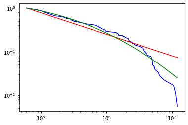

## 🎓 Cloud Computing Capstone Project - Coursera 🎓

Follow along the following steps for a walkthrough of Project dev and outputs.

## Table of Contents

| Title  | Description
|---|---|
| **1. Data Extraction and Cleaning** | [Mounting EBS snapshot, extracting and storing cleaned data in HDFS](#1. Data Extraction and Cleaning )|
| **2. Data Analysis using Hadoop and PySpark** | [Batch Processing using Hadoop and extracting results using PySpark API and storing information in Cassandra](#2. Data Analysis using Hadoop and PySpark)|
| **3. Solutions** | [Solutions from the dataset for the questions like best flight on a given day, top 10 airports etc.](#3.Solutions)|
|**4.Learnings and Optimizations**| [Learnings from the project and Optimizations performed](#4.Learnings and Optimizations)|


## 1. Data Extraction and Cleaning


**✅ Step 1a. Create an AWS or AWS Educate Account** :<br>
**✅ Step 1b. Mount EBS Snapshot**:

- Create a volume of the publicly available EBS Snapshot for Linux Machine in your region same as your EC2 Instance.
- Attach the volume to your instance and Mount it to your file system using the following commands:

```
$ lsblk                              //TO list all the blocks
$ sudo mkdir /data                   //Creating the directory for mounting
$ mount /dev/xvdf /data              //mounting /dev/xvdf on the /data folder created

```

**✅ Step 1c. Extract the csv files to HDFS**:

- The data stored in the EBS snapshot is in the form of csv files which are in a zipped folder. We use the following script to extract it to HDFS folder.

* [Extraction script on GitHub](https://github.com/Ashwini130/CourseraCloudProject/tree/master/Scripts/moveDataToHadoop.sh)

```
$moveDataToHadoop /data /DATA
```
**✅ Step 1d. Extract the csv files to HDFS**:

- Clean the extracted files using Spark. The cleaning operations performed on the dataset were as follows:

1. Post Data Exploration and examining a subset of the data it was observed that there are few rows of data having null values in ArrDelay columns(for flights that were cancelled). These null values might interfere with out analysis so we drop these columns

```
df = df.na.drop(Array("ArrDelay"));
```
2. In the Description of Transportation DataSet, it is mentioned that for some years the data collected has more columns, (which are not significant to out analysis) so we restrict our data columns to about 56 columns only(as opposed to some csv files having 75 columns)

```
val sliceCols = df.columns.slice(0, 55)
df = df.select(sliceCols.map(name=>col(name)):_*)
```

* [ETL script on GitHub](https://github.com/Ashwini130/CourseraCloudProject/tree/master/Scripts/ETL_script.sh)

```
$spark-shell -i ETL_script.scala
```

(make sure you have your hadoop cluster already setup with spark installed over hadoop before running scala script. For quickly setting up a 4 node hadoop cluster, follow this link : )

## 2. Data Analysis using Hadoop and PySpark

Following diagram specifies the architecture used to integrate various big data tools used for analysis. We will explore them step by step when we answer the given questions.


* Group 1

 **1. Rank the top 10 most popular airports by numbers of flights to/from the airport.**<br>
 
 For this problem, We use the simple wordcount problem logic to count the number of occurences of the airport in the source and destination columns of the data. The logic used is as follows:
 
 **Map Phase:**
 
 <airport_name(Key) 1(Value)> ,<airport_name(key) 1(value)>....
  
 **Reduce Phase:**
 
 airport_name value
 
 ```
 bin/yarn jar jars/CloudCapstone-0.0.1-SNAPSHOT.jar Task1/popularAirports.class /Cleaned_data /results/rankAirports
 ```
 
- [Reduce code for Group 1 Question 1](https://github.com/Ashwini130/CourseraCloudProject/blob/master/CloudCapstone/src/main/java/Task1/popularAirports.java)<br>

Post execution of the MapReduce operation we receive the following results in alphabetical order
 
 ```
ABE	228782
ABI	38376
ABQ	1414760
...
```

Post that we clean and sort the data using PySpark to extract the Top 10 Popular Airports.

```python
rdd.map(lambda line: line.split()).filter(lambda tuple: len(tuple) == 2).filter(lambda tuple: len(tuple[0])==3).map(lambda tuple: (int(tuple[1]),tuple[0])).sortByKey(ascending=False).take(10)
```

 **2.Rank the top 10 airlines by on-time arrival performance.**
 
 For this question, our column of interests are carrier_id and arrDelay(arrival delay) for the airline. In the map phase, we write the carrier id and it's arrival delay to disk and in the reduce phase we calculate the average of the arrival delay for each key and write the output in the following format:
 
 airport_name(key) avg_arrDelay(value)
 
- [MapReduce code for Group 1 Question 2](https://github.com/Ashwini130/CourseraCloudProject/blob/master/CloudCapstone/src/main/java/Task1/onTimeArrPerf.java)<br>

- Execution:
```
 bin/yarn jar jars/CloudCapstone-0.0.1-SNAPSHOT.jar Task1/onTimeArrPerf.class /Cleaned_data /results/onTimeArrPerf
 ```
The output of the Mapreduce Operation is as follows:
```
9E	5.8671846616957595
AA	7.108231958270729
AQ	1.1569234424812056
...
```

We take this resultset and process it in PySpark to extract top 10 airlines who have the best on time arrival performance.

Note : I am running PySpark on my local machine using Jupyter Notebook as the scope of my processing is small for this acitvity. Spark can be run in a cluster mode for higher workloads.

 ```python
rdd = file.cache()
rdd = rdd.map(lambda line: line.split()).cache()
rdd2 = rdd.map(lambda tuple: (tuple[-1],tuple[0])).cache()
rdd3 = rdd2.map(lambda tuple:(float(tuple[0]),tuple[1]))
rdd3.takeOrdered(10)
 ```
[PySpark code](https://github.com/Ashwini130/CourseraCloudProject/blob/master/JupyterNotebooks/onTimeArrPerf_pyspark.ipynb)
<br> 
 * Group 2
 
**1. For each airport X, rank the top-10 carriers in decreasing order of on-time departure performance from X.**

For this problem, our columns of interest are source airport,carrier id and departure delay of the csv file. Same as group 1, question 2, we perform the MapReduce operation where in the map phase we write the airport+carrier(compound key) to the disk along with the departure delay value whose average is calculated in the reduce phase.


- 
<br>

- Execution : 

```
 bin/yarn jar jars/CloudCapstone-0.0.1-SNAPSHOT.jar Task1/onTimeDepartPerf.class /Cleaned_data /results/onTimeDepartPerf
 ```
The output of the Mapreduce Operation is as follows:
```
ABE 9E	6.771714922048997
ABE AA	4.630407124681934
...
```

We take this resultset and process it in PySpark to extract top 10 carriers who have the best on time departure performance.

```python
file = sc.textFile('file:///C:/Users/Ashwini/Desktop/onTimeDepartPerf')
file = file.map(lambda line:line.split()).filter(lambda line:len(line)==3)
file1 = file.map(lambda tuple:(tuple[0],tuple[1],float(tuple[2])))

rdd = file1.map(lambda row: Row(airport=row[0], carrier=row[1], dep_delay=row[2]))
df = spark.createDataFrame(rdd)
```

We store this created dataframe into cassandra table so that we can retrieve the top-10 carriers for a given airport with minimum departure delay. 

I am running Cassandra locally because the scope of my project is quite small. Cassandra is very powerful key-value database to store and retrieve huge amounts of data(Big Data) faster and efficiently compared to relational databases.

Follow the instruction on official page for Cassandra to install cassandra on your system.<br>
Install the cassandra diver with the following command in Jupyter Notebook running PySpark. We use this as a connector between spark and cassandra to store and retreive data.

```
pip install cassandra-driver
```

Cassandra Table Definition:

```sql
cqlsh:aviation> create table carrier_depart_delay(
            ... airport text,
            ... carrier text,
            ... dep_delay decimal,
            ... PRIMARY KEY(airport,carrier,dep_delay)) WITH CLUSTERING ORDER BY
 (carrier asc,dep_delay desc);

```

Writing to Cassandra from PySpark:

```python

from cassandra.cluster import Cluster
from pyspark.sql import SQLContext

cluster = Cluster(['127.0.0.1'])  # Connect to Cassandra locally. Provide contact points and port
session = cluster.connect('aviation')   #keyspace 
sqlContext = SQLContext(spark)

df.write\
.format("org.apache.spark.sql.cassandra")\
.mode('append')\
.options(table = "carrier_depart_delay", keyspace = "aviation")  \
.save()
```

**2. For each airport X, rank the top-10 airports in decreasing order of on-time departure performance from X.**


For this problem, our columns of interest are source airport,destination airport and departure delay of the csv file. Same as group 1, question 2, we perform the MapReduce operation where in the map phase we write the airport+carrier(compound key) to the disk along with the departure delay value whose average is calculated in the reduce phase.


- [MapReduce code for Group 1 Question 2](https://github.com/Ashwini130/CourseraCloudProject/blob/master/JupyterNotebooks/onTimeAirDepart.ipynb)

- Execution:
```
bin/yarn jar jars/CloudCapstone-0.0.1-SNAPSHOT.jar Task1/onTimeDepartPerf.class /Cleaned_data /results/onTimeDepartPerf
```

The output of the Mapreduce Operation is as follows:
```
ABE ALB	10.0
ABE ATL	9.94767144319345
ABE AVP	3.4390070921985814
...
```

We take this resultset and process it in PySpark to extract top 10 destination airports who have the best on time departure performance with respect to an 'X' as source airport.

```python
file = spark.sparkContext.textFile("file:///C:/Users/Ashwini/Desktop/onTimeAirDepart")
file1 = file.map(lambda line:line.split()).filter(lambda line:len(line)==3)
rdd = file.map(lambda row: Row(src_airport=row[0],dest_airport=row[1], dep_delay=row[2]))
df = spark.createDataFrame(rdd)

```

We store this data into cassandra(key-value store) table so that we can retrieve the top-10 airports for a given airport with minimum departure delay. 

Cassandra Table Definition:

```sql
cqlsh:aviation> create table aviation.airport_src_dest_arrival(
            ... src text,
            ... dest text,
            ... arr_delay decimal,
            ... carrier text,
            ... PRIMARY KEY(src,arr_delay)) with clustering order by (arr_delay desc);
```

Writing to Cassandra from PySpark:

```python
df.write\
.format("org.apache.spark.sql.cassandra")\
.mode('append')\
.options(table = "airport_depart_delay", keyspace = "aviation")  \
.save()
```

**3. For each source-destination pair X-Y, rank the top-10 carriers in decreasing order of on-time arrival performance at Y from X.**

For this problem we have 4 columns of interest : src,dest,carrier and arr_delay. Here the key will again be a compoun key(src, dest, carrier) and the average arr_delay will be our value.\

[MapReduce Code](https://github.com/Ashwini130/CourseraCloudProject/blob/master/JupyterNotebooks/XYonTimeArrPerf.java.ipynb)

- Execution:
```
bin/yarn jar jars/CloudCapstone-0.0.1-SNAPSHOT.jar Task1/XYonTimeArrPerf.class /Cleaned_data /results/XYonTimeArrPerf
```

The output of the Mapreduce Operation is as follows:
```
ABE ALB AA	23.0
ABE ATL DL	6.266970753957606
ABE ATL EA	3.4953071672354947
...
```
We take this resultset and process it in PySpark to extract top 10 destination airports who have the best on time departure performance with respect to an 'X' as source airport.

```python
file = spark.sparkContext.textFile('file:///C:/Users/Ashwini/Desktop/XYonTimeArrPerf')
file = file.map(lambda line:line.split())
file1 = file.filter(lambda row:len(row)==4).map(lambda tuple:(tuple[0],tuple[1],tuple[2],float(tuple[3])))
df = spark.createDataFrame(rdd3)

```

We store this data into cassandra(key-value store) table so that we can retrieve the top-10 airports for a given airport with minimum departure delay. 

Cassandra Table Definition:

```sql
cqlsh:aviation> create table aviation.airport_src_dest_arrival(
            ... src text,
            ... dest text,
            ... arr_delay decimal,
            ... carrier text,
            ... PRIMARY KEY(src,arr_delay)) with clustering order by (arr_delay desc);
```

Writing to Cassandra from PySpark:

```python
df.write\
.format("org.apache.spark.sql.cassandra")\
.mode('append')\
.options(table = "airport_src_dest_arrival", keyspace = "aviation")  \
.save()
```

* Group 3

**1) Does the popularity distribution of airports follow a Zipf distribution? If not, what distribution does it follow?**

We use the python matplotlib library for this question to plot the distibution of the aiports and it's occurence in the data. 

[Python code for Plotting Distribution](https://github.com/Ashwini130/CourseraCloudProject/blob/master/JupyterNotebooks/Power%20Law%20Dist.ipynb)

The following is the Graph generated from the code.



```
Power law alpha: 1.494627
Power law D: 0.101342
Power law xmin: 60654
Log normal mu: 11.941681
Log normal sigma: 2.048870
-3.5442411161248812 0.0003937449777681864
```

<i>From the plot, it is clear that the distribution does not follow a Zipf distribution but rather follows a lognormal distribution.</i>


**2) Tom wants to travel from airport X to airport Z. However, Tom also wants to stop at airport Y for some sightseeing on the way. More concretely, Tom has the following requirements<br>
a) The second leg of the journey (flight Y-Z) must depart two days after the first leg (flight X-Y). For example, if X-Y departs on January 5, 2008, Y-Z must depart on January 7, 2008.<br>
b) Tom wants his flights scheduled to depart airport X before 12:00 PM local time and to depart airport Y after 12:00 PM local time.<br>
c) Tom wants to arrive at each destination with as little delay as possible. You can assume you know the actual delay of each flight.<br>
Your mission (should you choose to accept it!) is to find, for each X-Y-Z and day/month (dd/mm) combination in the year 2008, the two flights (X-Y and Y-Z) that satisfy constraints (a) and (b) and have the best individual performance with respect to constraint (c), if such flights exist.**<br>


This Problem focuses on dataset available for the year 2008. Hence, I wrote the code to analyse the data for the year 2008 and output the minimum delay for each day (AM and PM) for a flight. Using this output data we predict the fastest flight that will take the flyer to the destination with minimum delay.
 
We have a four value key(src.dest.am/pm,dep_date). The output values received with respect to this key is (carrier,flightnum,arrdelay,departuretime).


## 3. Solutions

## 4. Learnings and Optimizations

* Added combiner class in hadoop job code - sped up hadoop jobs by 45-50% in terms of time required
* Spark application code/job when submitted to the respective nodes will throw an error if an action function(collect or count) is not called before writing the data frame to a file(which is not true in the case of scala script)
* Initially, I was using 1GB RAM EC2 instances, but the Spark ETL operations could not complete in this memory configuration and the system had to be rebooted. So had to upgrade to 8 GB RAM for good performance and speed.(worked well in 4Gb ram as well for current use case)

